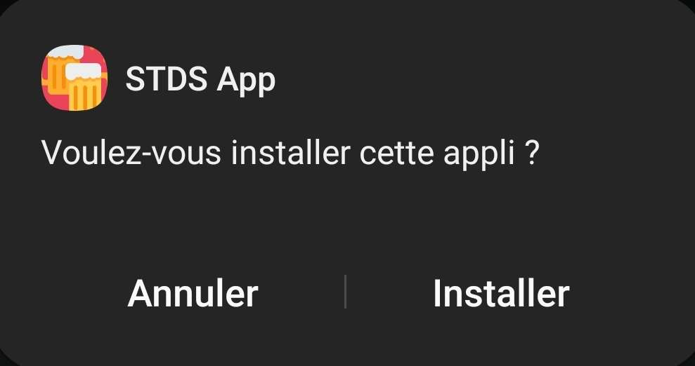
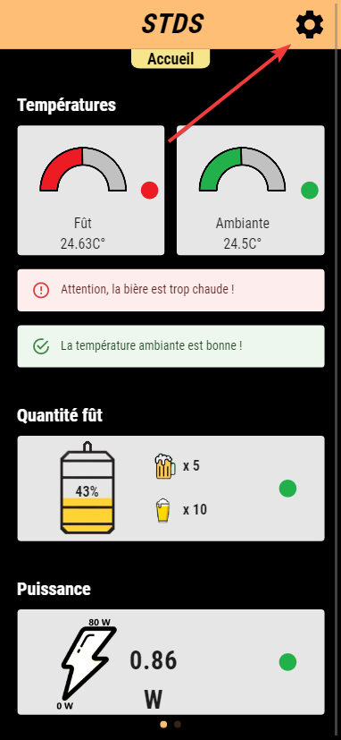
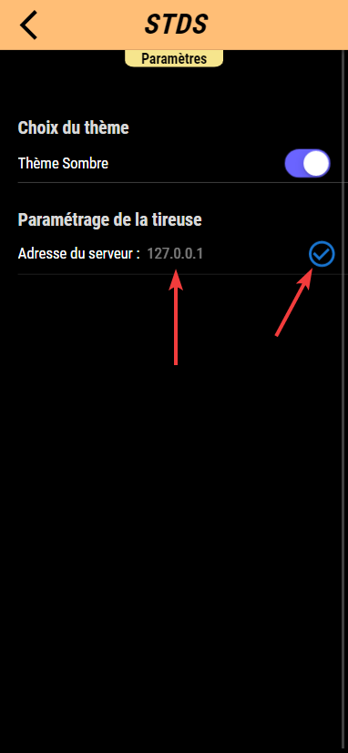

# Documentation utilitateur
:icons: font
:experimental:
:toc:

_v2.0 - 27/01/2023 - Equipe 4 - SAE ALT S3 Dev 22-23 STDS 3B_

== I. Installation du backend

=== 1. Prérequis

* Avoir une version de docker qui fonctionne correctement (https://www.docker.com[disponible ici]).
* Pouvoir décompresser un fichier au format `.zip`.
* Avoir les ports 8080 et 8086 ouverts.
* Avoir node.js installé, npm et npx doivent fonctionner correctement (https://nodejs.org/en/[disponible ici]). Sur Linux, exécuter la commande : `sudo apt-get install nodejs npm`.

=== 2. Téléchargement

* Télécharger le https://github.com/Falsimane/SAE-ALT-S3-Dev-22-23-STDS-3B-Equipe-4/raw/main/Architecture/Useful/DockerBack.zip[backend], puis le décompresser.

=== 3. Build

. Ouvrir le répertoire décompressé dans un terminal.
. Exécuter la commande `docker build -t node_tireuse .` et attendre la fin du build.

=== 4. Changement des identifiants Node-Red

Si vous souhaitez changer les identifiants de connexion à Node-Red, veuillez suivre les étapes suivantes :

* Ouvrir avec un éditeur de texte le fichier `settings.js` présent dans le dossier node_red_data.

* Une fois le fichier ouvert, il vous faut ouvrir un terminal dans le même répertoire et taper cette commande :

[source, bash]
----
node -e "console.log(require('bcryptjs').hashSync(process.argv[1], 8));" votre_mot_de_passe`
----

* Cette commande va vous retourner un hash, il vous suffit de le copier et de le coller dans le fichier `settings.js` à la ligne `n°80` à la place de l'ancien hash.

* Pour l'identifiant, il vous suffit de le modifier à la ligne `n°79`.

* Ensuite, il vous suffit de sauvegarder le fichier et de relancer le backend.

=== 5. Changement des identifiants InfluxDB

Si vous souhaitez changer les identifiants de connexion à InfluxDB, veuillez suivre les étapes suivantes :

* Ouvrir avec un éditeur de texte le fichier `docker-compose.yml` présent dans le dossier décompressé.
* Modifier les lignes `n°19` et `n°20` pour changer les identifiants de connexion à InfluxDB.
* Ensuite, il vous suffit de sauvegarder le fichier et de relancer le backend.

=== 6. Lancement

* Exécuter la commande `docker compose up`. 

== II. Installation de l'application

=== 1. Installation sur la plateforme Android

==== 1.1 Prérequis

* Avoir un téléphone Android, à partir de la version 5.0, capable d'installer des APK (Google PlayStore permet de les installer).
* Avoir 20 Mo d'espace de stockage libre.

==== 1.2 Téléchargement

* Télécharger le https://github.com/Falsimane/SAE-ALT-S3-Dev-22-23-STDS-3B-Equipe-4/tree/main/Application/STDS%20App%20-%20build[fichier APK].

==== 1.3 Installation

* Exécuter le fichier, puis cliquer sur installer, comme ceci :

ifdef::env-github[]
++++

  

++++
endif::[]

ifndef::env-github[]

endif::[]

* Ignorer les éventuels avertissements de sécurité (l'application n'étant pas installée depuis le Google PlayStore, des alertes peuvent apparaître).

==== 1.4 Lancement

* L'application se lancera ensuite comme toute application, elle sera également visible dans la liste des applications du téléphone.

=== 2. Installation de l'application IOS

Malheureusement, la politique d'Apple vis-à-vis des applications non publiées sur l'AppStore ne nous permet pas de fournir une application au format .ipa comme, nous le pouvons avec la version Android .apk. Il faudra potentiellement envisager l'achat d'une licence développeur pour publier l'application sur l'AppStore.

== IV. Utilisation de l'application

=== 1. Premier lancement

Au premier lancement, l'application affichera une erreur : c'est normal. Il faut avant tout chose configurer l'adresse du serveur contenant le Backend. Pour cela :

* Accéder à la page paramètres, en cliquant sur le rouage en haut à droite de la page :

ifdef::env-github[]
++++

  

++++
endif::[]

ifndef::env-github[]

endif::[]

* Entrer l'adresse du serveur, puis valider : 

ifdef::env-github[]
++++

  

++++
endif::[]

ifndef::env-github[]

endif::[]

* Si l'adresse entrée est correcte, et que le serveur est bien configuré, l'application devrait afficher un message de succès :

ifdef::env-github[]
++++

  

++++
endif::[]

ifndef::env-github[]

endif::[]

